  

  
  
  

## 👋 About me

I'm a **Cybersecurity master's student at Saarland University**. I like breaking things to understand them. Most of my time goes into **fuzzing, binary reverse engineering, web application security and applied cryptography**. Before Saarbrücken I studied Computer Science & Engineering in Bengaluru and wrote firmware for microcontrollers.

- 🔍 **Currently:** building coverage-guided and grammar-based fuzzers to find memory faults and parser bugs.
- 🏆 **Best Paper Award (2024):** *IVYCIDE: Smart IDS Against E-IoT Driver Threats*, an ML-based intrusion detection system for enterprise IoT.
- 🎤 **Seminar (2025):** *Politics of Security and Privacy*, Saarland University / CISPA. Topics: surveillance tech, censorship infrastructure and information leakage.
- 🤝 **Looking for:** working student and internship roles in security engineering, pentesting or security research.

## 🛠️ Toolbox

**Security**

**Languages**

**Build & ship**

<b>What I practise in security</b>

 

| Area | Focus |
| --- | --- |
| Web application attacks | XSS, SQLi, CSRF, SSRF, clickjacking, command injection |
| Binary analysis | Reverse engineering with Ghidra, crash triage |
| Testing | Coverage-guided fuzzing, grammar mining, grammar-based test generation |
| Cryptography | AES (CBC, GCM), key derivation (PBKDF2, scrypt), IV and nonce handling |
| Forensics & networks | Autopsy, Wireshark traffic analysis, Android app security |

## 🚀 Featured projects

<table>
<tr>
<td width="50%" valign="top">

### 🔐 [AES-Encrypt-Decrypt](https://github.com/RoshFps/AES-Encrypt-Decrypt)
A command-line file encryption tool built on **AES-256-GCM** with an **scrypt**-derived key. Wrong passwords and tampered files are rejected, never half-decrypted. It streams large files in chunks and has a versioned file format.

`Python` `cryptography` `CLI`

</td>
<td width="50%" valign="top">

### 🛡️ [SkrillX](https://github.com/RoshFps/SkrillX)
A CLI for securing AI-assisted software delivery. It sets up guardrails in a repo, runs checks and produces an HTML scorecard dashboard. Also includes shell completion and a parallel test runner.

`Python` `DevSecOps` `GitHub Actions`

</td>
</tr>
<tr>
<td width="50%" valign="top">

### 🚗 [Object Detection for Autonomous Driving](https://github.com/RoshFps/Object-Detection-in-Autonomous-Driving-System)
A small-scale self-driving car. Vision modules detect pedestrians, potholes, traffic lights, road signs and lanes with **YOLOv5** and OpenCV, then drive the motors over serial through an **Arduino**.

`Python` `YOLOv5` `OpenCV` `Arduino`

</td>
<td width="50%" valign="top">

### ✏️ [Sketch → HTML/CSS](https://github.com/RoshFps/HTML-and-CSS-Code-Generation-using-Image-Recognition)
Draw a web form on paper and get a working page back. A **Faster R-CNN** model detects UI elements, which are laid out as HTML and styled with generated CSS. Includes a Flask web app with hardened uploads.

`Python` `TensorFlow` `Flask`

</td>
</tr>
<tr>
<td colspan="2" valign="top">

### 🗺️ [Bangalore Explorer](https://github.com/RoshFps/Bangalore-Explorer)
A budget trip planner built with Streamlit and MySQL. I hardened the original prototype with **scrypt** password hashing, fully parameterised SQL (no injection), input validation, login rate-limiting and a least-privilege DB user. `Python` `Streamlit` `MySQL` `AppSec`

</td>
</tr>
</table>

## 🔬 Research & coursework projects

| Project | What I built |
| --- | --- |
| **Coverage-guided vulnerability fuzzing pipeline** | A grey-box fuzzer combining mutation and grammar-based inputs, with branch-coverage feedback from instrumented binaries. It found crashes in 3 target programs. |
| **Grammar mining & protocol input modelling** | AST-based pipelines that extract input grammars and generate thousands of grammar-conforming inputs to stress protocol parsers. |

## 🎓 Education & experience

| | |
| --- | --- |
| 🎓 **M.Sc. Cybersecurity** | Saarland University, Saarbrücken · *Oct 2024 – present* |
| 🎓 **B.E. Computer Science & Engineering** | The Oxford College of Engineering (VTU), Bengaluru · *2020 – 2024* |
| 💼 **Embedded Systems Development Intern** | Emterxe Technology, Bengaluru · *Aug – Oct 2023* PIC16F877A firmware, timing-critical protocol debugging, test documentation in a 5-person agile team |

---

  💬 Happy to talk about security or crypto implementations. <a href="mailto:roshan7156@gmail.com">Drop me a line</a>.

